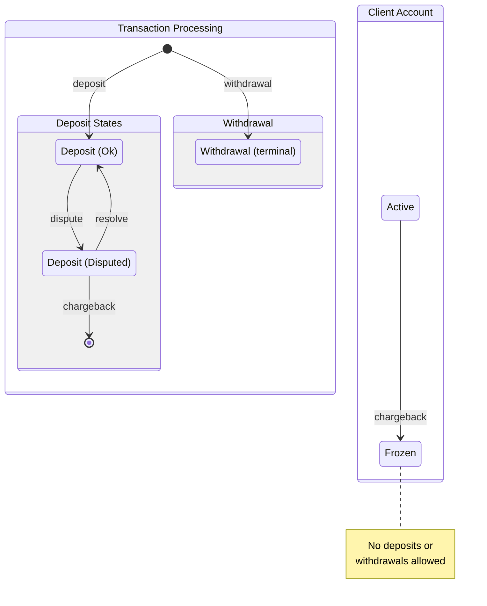
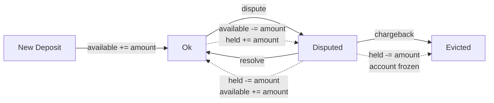

# txs-eng

A simple transaction processing engine that reads transactions from a CSV file, processes deposits, withdrawals, deposit disputes with resolutions and chargebacks, then outputs the final state of client accounts.

## State Diagram

### Deposit Lifecycle with dispute

### Balance Changes

| Action | Available | Held | Total |
|--------|-----------|------|-------|
| Deposit | +amount | - | +amount |
| Withdrawal | -amount | - | -amount |
| Dispute (deposit) | -amount* | +amount | unchanged |
| Resolve | +amount | -amount | unchanged |
| Chargeback | - | -amount | -amount |

*Available may become negative if client has already spent the disputed funds (debt).

## Assumptions

1. **Only deposits can be disputed** - Withdrawals cannot be disputed.

2. **Transaction IDs are globally unique** - A transaction ID cannot be reused across deposits and withdrawals.

3. **Client mismatch is rejected** - A dispute/resolve/chargeback referencing a transaction must come from the same client who made the original transaction.

4. **Disputes can cause negative available balance** - If a client has withdrawn funds from a deposit that is later disputed, the dispute still succeeds. The available balance becomes negative, representing debt owed. A warning is logged when this occurs.

5. **Chargedback deposits are evicted** - Once a deposit is charged back, it cannot be referenced again (terminal state).

6. **Frozen accounts reject all transactions** - After a chargeback, the account is frozen and cannot accept new deposits or withdrawals.

7. **Resolved deposits can be disputed again** - A deposit that was disputed and then resolved returns to the `Ok` state and can be disputed again.

## Design Decisions

### Fixed-Point Arithmetic
Amounts use fixed-point decimal representation (4 decimal places stored as i64) to avoid floating-point precision issues in financial calculations.

### Streaming Architecture
Transactions are processed via async streams using tokio, allowing the engine to handle incoming transactions as streams without loading everything into memory. However the dispute feature requires in-memory storage of applied transactions that grows linearly with the size of the input, in a production environment we would use a database and keep only recent applied transactions in memory.

### Separate Storage for Deposits and Withdrawals
- **Deposits**: Stored with full record (client, amount, state) for dispute tracking
- **Withdrawals**: Only tx ID is stored (for duplicate checking) since they cannot be disputed

### Error Handling
Invalid transactions (insufficient funds, duplicate IDs, frozen accounts, etc.) are logged on stderr and skipped without stopping the engine.

